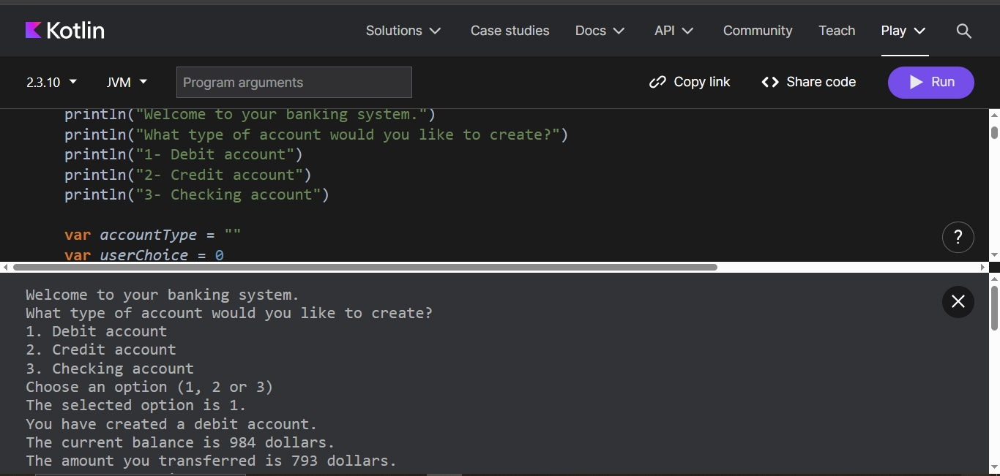
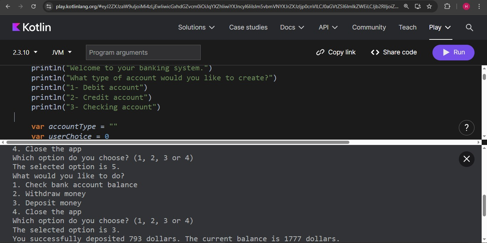
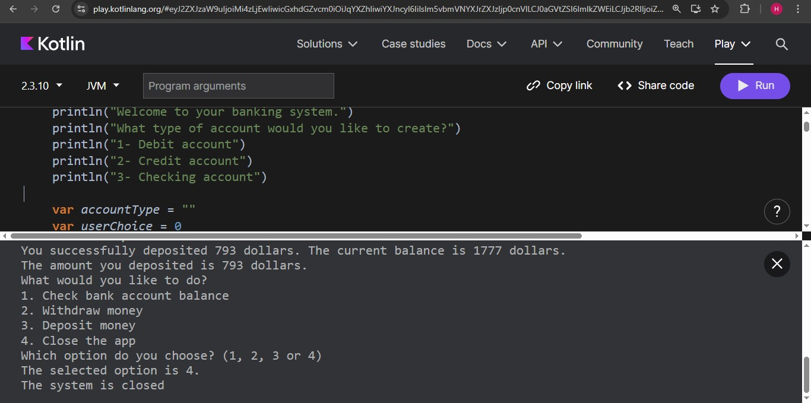

# Bank Account Console App

## Description
This project is a simple console-based banking application developed in **Kotlin**.  
It simulates the creation and management of different bank account types using basic programming concepts.

## Features
- Create a **Debit**, **Credit**, or **Checking** account
- Display account balance
- Withdraw money with account-specific rules
- Deposit money with credit account constraints
- Menu-driven interaction (console simulation)

## Concepts Used
- Variables (`var`, `val`)
- Conditional statements (`if`, `when`)
- Loops (`while`)
- Functions with parameters and return values
- Basic business rules simulation

## Résultat

  
<em>Figure 1</em>
 

  
<em>Figure 2</em>
 

  
<em>Figure 3</em>
 

  
<em>Figure 4</em>
 

  ## Technologies
- Language: Kotlin
- Environment: Kotlin Playground or IntelliJ IDEA
